```mermaid
graph LR

    %% DEFINING THE NODES AND SHAPES
    USER((("👤 USER<br/>(Argent X)")))
    STARKNET["🟦 STARKNET L2<br/>(Vault.cairo)"]
    GEMINI((("🧠 GEMINI FLASH<br/>(AI Intent)")))
    ORACLE{{"🔮 SHADOW ORACLE<br/>(Supabase + Node.js)"}}
    BCH["🟩 BITCOIN CASH<br/>(ShadowCard.cash)"]
    MERCHANT["🏪 MERCHANT<br/>(UTXO Receiver)"]

    %% ROUTING (DIAMOND CLUSTER TO KEEP IT COMPACT)
    USER -- "deposit & request_swipe" --> STARKNET
    USER -. "1. 'Pay $5 for coffee'" .-> GEMINI
    GEMINI -. "2. Intent JSON" .-> STARKNET
    
    STARKNET == "3. SolvencySignal" ==> ORACLE
    ORACLE == "4. Sign(Attestation)" ==> BCH
    
    BCH -. "5. Instant Release" .-> MERCHANT

    %% ==========================================
    %% HIGH-CONTRAST NEO DARK STYLING
    %% ==========================================
    
    %% Purple/Lavender for User & AI
    style USER fill:#4c1d95,stroke:#a855f7,stroke-width:3px,color:#ffffff,font-weight:bold
    style GEMINI fill:#4c1d95,stroke:#c084fc,stroke-width:2px,color:#ffffff,font-weight:bold

    %% Blue for Starknet Vault
    style STARKNET fill:#1e3a8a,stroke:#60a5fa,stroke-width:2px,color:#ffffff,font-weight:bold,stroke-dasharray: 5 5

    %% Neon Orange/Coral for the Oracle Core (Center)
    style ORACLE fill:#9a3412,stroke:#fb923c,stroke-width:4px,color:#ffffff,font-weight:bold

    %% Green for Bitcoin Cash & Settlement
    style BCH fill:#14532d,stroke:#4ade80,stroke-width:2px,color:#ffffff,font-weight:bold
    style MERCHANT fill:#064e3b,stroke:#34d399,stroke-width:2px,color:#ffffff,font-weight:bold

    %% LINK STYLES (Bright neon lines for readability)
    linkStyle 0 stroke:#60a5fa,stroke-width:2px,color:#bfdbfe
    linkStyle 1 stroke:#a855f7,stroke-width:2px,stroke-dasharray: 5 5,color:#d8b4fe
    linkStyle 2 stroke:#a855f7,stroke-width:2px,stroke-dasharray: 5 5,color:#d8b4fe
    linkStyle 3 stroke:#fb923c,stroke-width:3px,color:#fed7aa
    linkStyle 4 stroke:#4ade80,stroke-width:3px,color:#bbf7d0
    linkStyle 5 stroke:#34d399,stroke-width:2px,stroke-dasharray: 5 5,color:#a7f3d0
```

# 🛰️ Zero-Gravity (0G)

> **The First Bridgeless Solvency Protocol for Starknet & Bitcoin.**
> *Spend your Starknet vault balance instantly via UTXO Covenants. We prove OP_CAT mathematics and cross-chain solvency loops today using CashScript.*

---

## 🧠 How It Works

Zero-Gravity is a **State-Verification Loop** — no tokens cross chains, only proofs.

1. **Lock** — Deposit into your Starknet Vault (Validium). Your balance is proven on-chain.
2. **Attest** — The Shadow Oracle verifies your L2 solvency and signs a cryptographic attestation.
3. **Release** — UTXO Covenant verifies the signature and instantly releases fractional liquidity to the merchant.

**Total time: ~3-5 seconds. Zero bridging. Zero identity leakage.**

---



---

## 🛠️ Tech Stack

| Layer | Technology |
|---|---|
| **Smart Contracts** | Cairo 2.x (Starknet) + CashScript (BCH) |
| **Oracle** | Node.js / TypeScript |
| **AI** | Google Gemini 3 Flash (NL → TX Intent) |
| **Database** | Supabase (PostgreSQL + Realtime + RLS) |
| **Frontend** | Next.js 14 (App Router) |
| **Wallets** | Argent X (Starknet) + Burner Wallet (BCH) |

---

## 🚀 Quick Start

```bash
# Clone
git clone https://github.com/Rasslonely/Zero---Gravity.git
cd Zero---Gravity

# Install all workspaces
npm install

# Copy environment template
cp .env.example .env
# Fill in your API keys (see .env.example for guidance)

# Start frontend
npm run dev --workspace=apps/web

# Start Oracle daemon
npm run oracle
```

---

## 📜 Contracts

| Contract | Chain | Address |
|---|---|---|
| `Vault.cairo` | Starknet Sepolia | `0x7e2f9fae965077e6c47938112dfd15ba4b2aa776d75661b40b8bacc3c3f57cb` |
| `ShadowCard.cash` | BCH Chipnet | `bchtest:p0rcmcclq2uz5qvk0h6wlmrjj4zrtvz3qsucm7txe5jzh8d9x25dwms0hqfqf` |

---

## 🔒 Security

- **STRIDE threat model** with 7-layer defense-in-depth
- **AI prompt injection** hardened: regex pre-filter + hardened system prompt + Zod post-validation
- **Supabase RLS** on all 5 tables — no IDOR possible
- **Nonce + TTL** prevents replay attacks
- **Oracle key** never exposed to client

---

## 📄 License

MIT

---